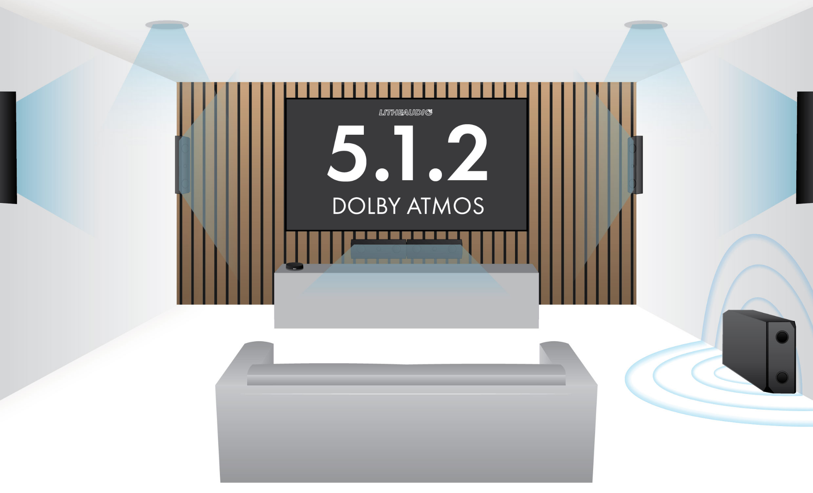

# What Is Audio

## Waveform

> 음성 데이터를 구분하는 기본 폼
> 방향(Channel), Time Series 2개로 나뉨

> ### 방향 채널
> 방향 : Mono Channel (1채널), Stereo (2채널), 5.1 Channel(6채널)...
> 이 때, 5.1, 7.1 채널같은 경우, 전대역 스피커의 개수를 앞, 서브우퍼를 뒷숫자에 기입
>
> - Dolby Atmos와 같은 경우, 5.1.2와 같은, Height 스피커 포함

---

> ### 시간축
> 시간에 따른 진폭 (-1 ~ 1) 값이 Assign됨 ($s[c][t] \in [-1, 1], c=channel$)
>
> 인간의 귀는 해당 진폭을 로그 스케일로 인식 (dB의 원리)
> - Ex : 진폭이 2배 증가 시, 우리는 +6dB, 즉 1.5배정도 증가한 것으로 인지
> - `-` 부분은 공기가 당겨지는 부분, `+` 부분은 공기를 밀어내는 값
>   - 우리는 해당 값의 '변화량' $(\Delta s)$ 을 인지해서 소리를 듣는다고 판단
>   - 따라서 -1에서 1로의 진폭 변화가 가장 충격이 큰 신호라 볼 수 있음